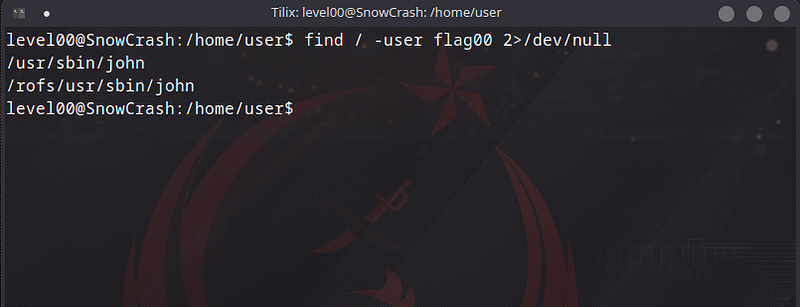
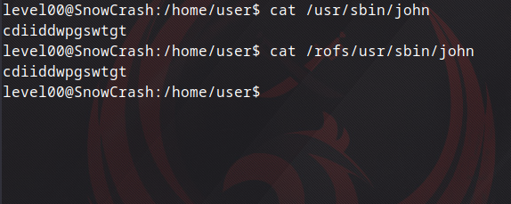
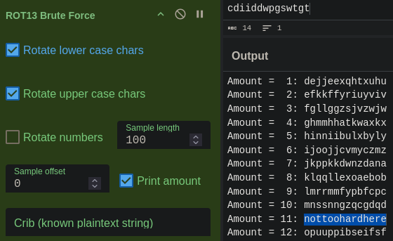
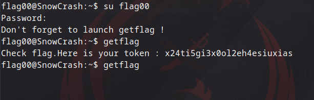

## Level00

Öncelikle giriş yaptığımız kullanıcı için dizinler arasında geri gelip `/home/user` klasörü içinde `ls` komutu yazmamıza bile izin vermeyip yetkimizin yetmediğini söylüyor. Bizden subject üzerinde flag00 dosyasını bulmamızı istiyor bir sonraki level'e geçebilmek için. Bu yüzden flag00 için hangi dosyaları kullanabiliriz buna bakacağız.

```bash
find / -user flag00 2>/dev/null
```

Bu komutu tek tek açıklayalım. `find` komutu dosyaları ya da dizinleri bulmamızı sağlıyor burada da `/` ile belirtiyoruz ki en üst dizinden yani sistemin kök dizininden itibaren bulmaya çalışsın. Aramayı hangi kullanıcıya göre yapacağını belirtmek için `-user` parametresiyle flag00 kullanıcısının çalıştırabileceği dosyaları aratabiliyoruz. `2>/dev/null` kısmındaki `2>` ise `stderr` yönlendirmek için kullanıyoruz. Çünkü `/dev/null` sistemde hiçbir şey içermeyen özel bir dosyadır ve buraya yönlendirdiğimiz tüm çıktılar yok edilir. Biz bu şekilde arama yaparken **_"Permission denied"_** gibi hata mesajları oluşursa ki komut çalışırken çok fazla hata mesajı görebiliriz bunları görmemek adına yazdığımız bir komut. Komutun çıktısında şöyle bir ekranla karşılaşıyoruz:



Bu dosyaları gördüğümde John The Ripper (parola kırma aracı) aracı olduğunu anladım ve okumaya çalıştığımızda



2 dosyanın da aynı sonucu verdiğini görüyoruz. İlk izlenimde Rot13 şifrelemesi olduğunu düşündüm ama emin olmak için [CyberChef](https://gchq.github.io/CyberChef) üzerinde brute attım ve



bu şekilde `nottoohardhere` cevabını buldum. Şimdi ise bize yine subject'te belirtilen `su flag00` komutuyla token almak için bulduğumuz değeri giriyorum.



Burada girdikten sonra bize `getflag` komutunu başlatmayı unutmamamızı söylüyor. Artık flag00 değerini doğru girdiğimiz için bize bir token veriyor ve bu token level01'in şifresi oluyor. `su level01` yazıp aldığımız token'ı şifre olarak girdiğimizde level01'e başarılı bir şekilde giriş yapmış oluyoruz.
