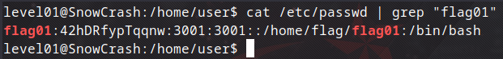
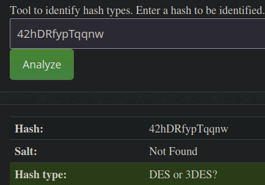
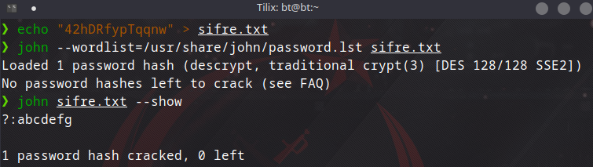
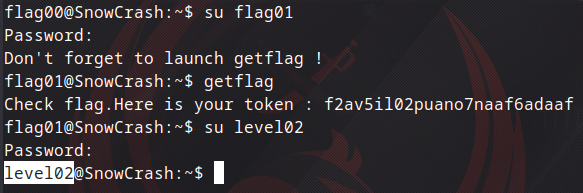

## Level01

Bu level özelinde de yine bir şeye bakmamıza izin vermiyor zaten bir önceki level'da ilk buraya bakmıştım ve dikkatimi flag01 çekmişti ama flag00 orada olmadığı için oraya yazmadım şimdi de oraya bakıyorum direkt yani `/etc/passwd` dosyasında flag01 kullanıcısını arıyorum. Şu komutla:

```bash
cat /etc/passwd | grep "flag01"
```

dosyanın içeriğini okuduğumda garip şifrelenmiş bir değer vardı.



Bu değerin hangi algoritmayla şifrelendiğini bulmak için [HashAnalyzer](https://www.tunnelsup.com/hash-analyzer/) sayfasında analiz ettim ve



DES algoritmasıyla şifrelenmiş olabileceğini gördüm. Bir önceki level üzerinde John The Ripper aracını görmüştük ve onun zaten DES hash'ini kırmak için optimize edildiğini biliyorum bu yüzden onu kullanacağız fakat burada bir şey kullanmamıza izin vermediği için ben de zaten kendi bilgisayarımda önceden kurmuş olduğum için orada kullanacağım.



Bu şekilde kendi bilgisayarımda john ile çalıştığımda gizli değere ulaştım.



Böylece artık level02'ye başarılı bir şekilde geçmiş olduk.
