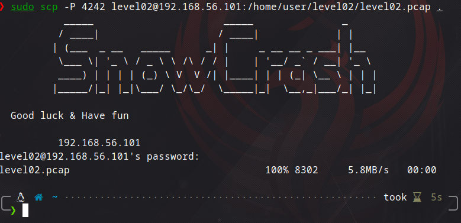
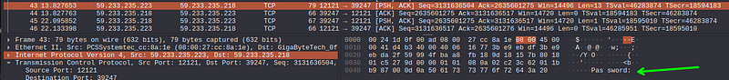
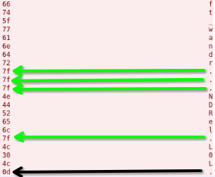
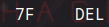
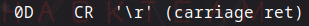
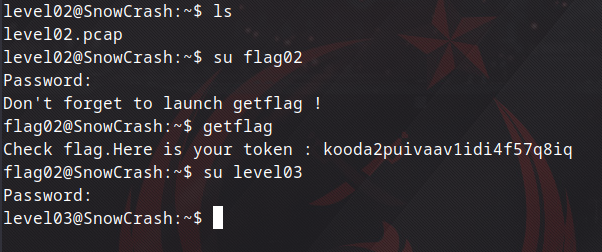

## Level02

Level02'ye giriş yapıp `ls` yazdığımızda bir `.pcap` uzantılı dosyayla karşılaşıyoruz. Bunu Wireshark ile analiz edeceğim. Wireshark ise ağ üzerinde arka planda olan trafiği izlememizi sağlayan bir araç. Bu dosyayı bilgisayarıma almak için subject üzerinde söylenen `scp` komutunu kullanacağım.

```bash
sudo scp -P 4242 level02@192.168.56.101:/home/user/level02/level02.pcap .
```



Ardından Wireshark ile incelemeye başlamak için önce dosya izinlerini değiştirmemiz gerekiyor. `chmod 777 level02.pcap` komutuyla hızlıca değiştirdim. Tek tek tüm dosyalarda inceleme yaparken 43. dosyada *Password:* yazan bir kısım gördüm ve açtığımda 



şifrenin verildiği bir satırla karşılaştım fakat buradaki nokta olarak verilen kısımlar yazdırılamaz veriler olduğu için dosyayı hexdump olarak inceledim. 



Burada görüldüğü üzere yazdırılamayan karakterler `7F` ve `0D` olarak gözüküyor. `man ascii` komutuyla bunların hangi karakterler olduğuna baktığımızda ise 

 

`delete` ve `\r` olduğunu görüyoruz yani nokta olan kısımlarda silinmiş ve sonda da bir alt satıra geçtiğini görüyoruz o halde burada nokta olan kısımları düzenlediğimizde aslında 3 kez üst üste silindiğini vs görebiliyoruz yani bu bilgilerle şifreyi düzenlediğimizde `ft_waNDReL0L` olarak şifreyi elde ediyoruz. Bunu flag02 için denediğimizde de token'ı elde ediyoruz.



Böylece başarılı bir şekilde level03'e geçiyoruz.
