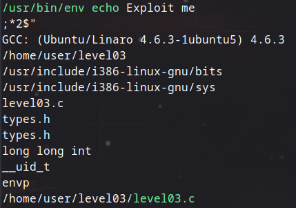

## Level03

Direkt olarak `ls -la` yazdığımızda karşımıza `level03` adlı bir dosya çıkıyor. Burada dosyanın kullanıcı gruplarında `flag03` olan sadece level03 dosyası var.


Dosyanın içeriğine bakmaya çalıştığımda giriş yapamadım fakat `cat` komutuyla içeriğini okumaya çalıştığımda şu şekilde kodlarla karşılaştım:


buradaki kodları biraz inceleyip araştırdığımda binary dosya ya da derlenmiş dosya olabileceğine dair bilgi sahibi oldum. Bu yüzden dosyanın tam olarak türünü anlamak istedim ve `file level03` ile baktım LSB executable olduğunu gördüm yani linux'ta çalıştırılabilir bir dosya olduğunu anlamış oldum. Bu yüzden debug modunda çalıştırdım.


`gdb level03` şeklinde debug modunda başlattım ve ilk önce benden girdi beklediğine emin olmak için test yazdım ve komutu algılayamadığını söyledi demek ki arka planda komut olup olmadığını check ediyor bu yüzden çalıştırmayı başlatsın diye `run` yazmayı denedim ve `Exploit me` şeklinde bir mesajla karşılaştım. Ardından `strings` komutuyla fonksiyonlarına baktım ve



burada yeşille gösterdiğim kısımlarda `echo` kullanıldığını ve bir `.c` uzantılı dosya olduğunu gördüm. Kaynak kodlarını incelemek için ve Ghidra ile detaylıca bakmak için dosyayı kendi bigisayarıma bir önceki level02'de olduğu gibi `scp` komutuyla çektim ve dosyayı [Dogbolt](https://dogbolt.org/) sitesine attım.


Kodda kullanılan fonksiyonlara da baktığımızda kullanıcı ID ve group ID'leri değiştirdiğini görebiliyoruz. Buradan da programın başka bir kullanıcının yetkileriyle çalıştırılabilir olduğunu anlıyoruz. Ardından `/usr/bin/env echo` komutunu çağırıp sistemde program ararken `PATH` değişkeni üzerindeki ayarı kullanıyor. Bu değişken ise bir program çalıştırılırken sistemin hangi dizinlerde bu programı arayacağını söyleyen bir liste diyebiliriz. Mesela eğer `echo` yazarsak sistem önce `/usr/bin` dizinine bakar `echo` oradaysa çalıştırır, bulamazsa diğer dizinlere bakar. Biz de sistemin çalışma mantığını değiştirip eğer `PATH` değişkenine `/tmp` dizinini eklersek ve bu dizine sahte bir `echo` koyarsak sistem önce bizim hazırlamış olduğumuz sahte programı çalıştıracaktır. Bu işleme de symlink diyoruz kısaca sahte bir bağlantı oluşturmak.

Nasıl yapacağımıza gelirsek biz aslında `/bin/getflag` programını çalıştırmak istiyoruz fakat program direkt olarak bunu çalıştırmayıp `echo` arıyor. Bu yüzden `/tmp` dizinine symlink oluşturacağız:

```bash
ln -s /bin/getflag /tmp/echo
```

bu şekilde `/tmp/echo` dosyasını oluşturmuş oldum ama bu dosya aslında `/bin/getflag` oluyor yani `/tmp/echo` çalıştırılırsa aslında `getflag` çalıştırılmış olacak. Sonrasında `PATH` ayarını değiştirmemiz gerekiyor bunun için de:

```bash
export PATH=/tmp:$PATH
```

bu şekilde ayarladıktan sonra artık dosyayı çalıştırabiliriz. 


Flag'i elde ettiğimize göre artık level04'e geçebiliriz.
