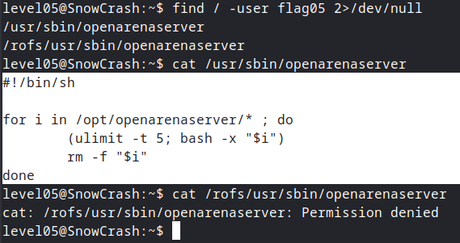
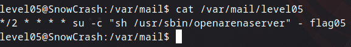
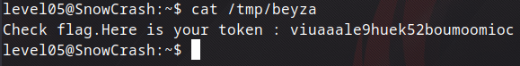

## Level05

Burada `ls -la` yazdığımızda hiçbir şey gelmiyor bu yüzden ilk seviye olan level00'da yaptığımız gibi `flag05` kullanıcısının hangi dosyalara erişimi olduğuna bakıyorum.



Dosyaların içeriğini okumaya çalıştığımda ise bu şekilde kodlar görüyorum. Buradaki kod `/opt/openarenaserver/` dosyasındaki tüm dosyaları 5 saniye CPU limitiyle çalıştırıyor ve işlem bitince dosyayı siliyor. Buradaki `bash -x` parametresi komut çalışmadan önce terminale çıktısını veriyor yani neler olup bittiğini görebiliyoruz. Aynı zamanda bu klasöre kendi dosyamızı koyabiliyoruz. Kodun içeriğinde 5 saniyede çalışan bir işlem gördüğümüz için burada crontab ile ilgili bir durum olabilir. Crontab, belirli zaman aralıklarıyla script'leri çalıştıran bir araç ve çıktılarını illaki bir yere yazar. Yazdığı yer de `/var/mail` olacağını düşünerek oraya bakıyorum.



Burada görüldüğü gibi her 2 dakikada bir `flag05` yetisiyle `/usr/sbin/openarenaserver` script'ini çalıştırıyor. Bunu gördükten sonra `/opt/openarenaserver/` içine bir shell script koyup `getflag` komutunu çalıştırabiliriz. Böylece sonucu kaydedecek. 

```bash
echo "/bin/getflag > /tmp/beyza" > /opt/openarenaserver/beyza
```

Burada çalıştırmak istediğim `/bin/getflag` komutunu `/tmp/beyza` olarak yerleştiriyorum ki cronjob bu script'i çalıştırsın ve `/tmp/beyza` dosyasına flag'i yazsın. Eğer direkt olarak `/opt/openarenaserver` altında tutmaya çalışsaydık yani `/tmp/beyza` altına hiç yazmasaydık, `/opt/openarenaserver/` altındaki dosyalar çalıştırıldıktan sonra hemen silindiği için erişemezdik. Zaten subject üzerinde de bize hiçbir şeyi şansa bırakmayın ve makine üzerinde direkt olarak çalışmayın diyor.

Ardından flag değerine erişebilmek için max cronjob süresi kadar bekledikten sonra okumaya çalıştığımızda



flag'e erişmiş oluyoruz ve level06'ya geçiyoruz.
