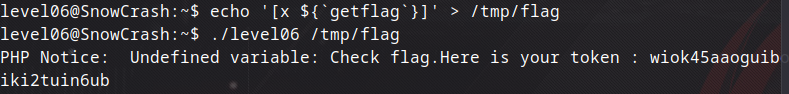

## Level06

Burada `ls` yazdığımızda karşımıza 2 tane dosya çıkıyor.


İlk olarak `./level06` dosyasını çalıştırdığımda 


bu şekilde bir hata alıyorum yani bize dosya adının boş olamayacağını söylüyor ve bu uyarının `level06.php` dosyasının 4. satırındaki fonksiyondan kaynaklı olduğunu bildiriyor. Önce dosya verdiğimde ne yapacağını merak ettiğim için 


bu şekilde `/tmp` altında `test` adında bir dosya oluşturup içine de `beyza` değerini atıyorum ve `./level06` dosyasına verdiğimde dosyanın içindeki değeri okuduğunu gözlemliyorum. Ardından

```bash
cat level06.php
```

şeklinde PHP dosyasını okuduğumda

```php
#!/usr/bin/php
<?php
function y($m) { $m = preg_replace("/\./", " x ", $m); $m = preg_replace("/@/", " y", $m); return $m; }
function x($y, $z) { $a = file_get_contents($y); $a = preg_replace("/(\[x (.*)\])/e", "y(\"\\2\")", $a); $a = preg_replace("/\[/", "(", $a); $a = preg_replace("/\]/", ")", $a); return $a; }
$r = x($argv[1], $argv[2]); print $r;
?>
```

böyle bir kodla karşılıyorum. Buradaki kodu kısaca açıklamaya çalışmak gerekirse, `x` ve `y` adında 2 fonksiyon var. `y` fonksiyonu, **_'. (nokta)'_** gördüğünü **_'x'_** ile, **_'@'_** gördüğünü **_'y'_** ile değiştiriyor. `x` fonksiyonu ise verdiğimiz dosyayı okuyup bir regex işlemiyle `[x ..]` şeklinde işliyor. `preg_replace` adındaki fonksiyon ise `/e` ile bulduğu ifadeyi PHP kodu gibi derliyor. Yani `[x ..]` içinde yazdığımız her şeyi PHP kodu olarak çalıştırıyor.

Buradan anlamamız gereken zafiyet şu, `/e` sayesinde kontrol edebildiğimiz `[x ..]` içine ne girersek girelim PHP koduna dönüşecek. Biz de bunu kullanarak PHP kodunun içine, command injection şeklinde düşünürsek payload yerleştirebilirim. Yani shell komutu yazıp çalıştırabiliriz.



`/tmp` altında `/flag` adında bir dosya oluşturup içine `getflag` değerini attım ve `./level06` dosyasına `/tmp/flag` dosyasını verdiğimizde bize `getflag` değerini vermiş oldu. Böylece başarılı bir şekilde level07'ye geçebiliriz.
