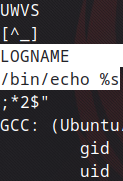

## Level07

Burada ilk olarak `level07` adında bir dosya görüyoruz. Çalıştırdığımızda dosya adı ya da hostname'i verdiğini düşündüm ama emin olmak için 


dosyanın içeriğini incelemem gerekiyor. `ltrace level07` komutuyla incelediğimde içinde 



bu şekilde kullanılan komutları gördüm. Dosyayı önceki level'lerde olduğu gibi `scp` komutuyla dosyayı bilgisayarıma çekip incelediğimde şu kodlarla karşılaştım:

```c
char * env_val = getenv("LOGNAME"); // 0x8048576    
asprintf(&buffer, "/bin/echo %s ", env_val);
```

burada ortam değişkenlerinden biri kullanılıyor. `LOGNAME` değişkenini `echo` komutuyla ekrana yazdırıyor. O halde bir değeri `LOGNAME` olarak ayarlayabiliriz.


Mesela burada değeri `beyza` olarak ayarladım ve dosyayı çalıştırdığımda beyza aradı ve bulamadığı için hata verdi böylelikle emin oldum oraya `getflag` değerini verdiğimde onu arayıp bana verecek.


Başarılı bir şekilde flag değerine ulaşıp bir sonraki level'e geçiyoruz.
