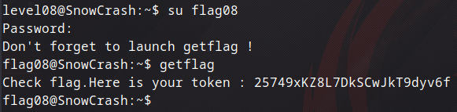

## Level08

İlk girişimizde 2 tane dosya karşılıyor bizi.

Burada tüm dosyalar `level08` kullanıcısı yetkisinde ama `token` dosyası `flag08` yetkisinde bu yüzden onu okuyamıyoruz.

Eğer dosyanın adını değiştirebilirsek okuyabileceğiz bu yüzden symlink kullanıp aynı dosyayı başka bir isimle göstereceğim.

Bu şekilde flag08 değerine ulaştık. 

Ardından başarılı bir şekilde diğer level'e geçiyoruz.
