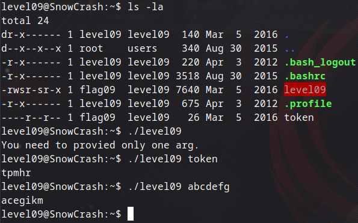
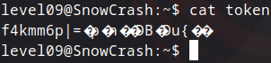
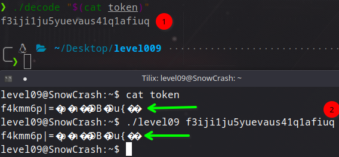
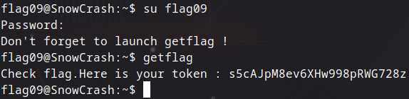

## Level09

Burada ilk olarak karşımıza 2 dosya geliyor.

`level09` dosyası çalıştırılmak için yanına bir argüman istiyor. `token` dosyasını verdiğimde onu dosya değil string olarak algılayıp garip bir çıktı veriyor. Ardından `abcdefg` argümanı girdiğimde anlıyorum ki ilk harf sabit kalıyor ama sonrasında her harfi kaçıncı indeksteyse o kadar artırarak kendisinden sonraki harfleri yerine getirerek encode ediyor. Ardından `token` dosyasını okumaya çalıştığımda

böyle bir çıktıyla karşılaşıyorum. Bu değeri `level09` dosyasına argüman olarak verip çalıştırdığımda hiçbir işime yaramayacak çünkü zaten encode işlemi gerçekleştiriliyor. Bu yüzden `scp` komutuyla dosyaları kendi bilgisayarıma çekiyorum ve decode işlemi gerçekleştirilecek olan `c` algoritmasını yazıyorum.

[Decode Algoritması](decode.c)

Bu şekilde yazdıktan sonra aşağıdaki gibi çalıştırıyorum ve

bu çıktıyı alıyorum ardından o değeri gidip `./level09` dosyasıyla çalıştırıyorum ve encode değerleri eşleşiyor. Yani şifreyi başarıyla decode edebildik. Bu değeri `flag09` için girerek `getflag` değerine erişiyoruz.

Böylece level10'a başarılı bir şekilde geçiyoruz.
