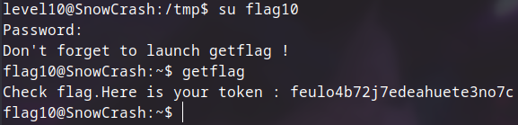

## Level10

Bu level'e girdiğimizde `ls -l` yazdığımızda karşımıza `level10` ve `token` dosyaları geliyor. Bu 2 dosyanın da izinlerinin `flag10` olduğunu görüyoruz. Amacımız önceki level'lerde olduğu gibi token dosyasının içeriğini öğrenmek. Önce çalıştırılabilir olan `level10` dosyasının nasıl çalıştığını anlamak için çalıştırıyoruz.


Bu çıktıdan anlıyoruz ki program argüman olarak bir dosya ve host bekliyor. Eğer dosyaya erişimimiz varsa, içeriği belirttiğimiz sunucuya göndermeye çalışıyor. Deneme yapmak için


bu şekilde veriyoruz argümanları. Erişimimiz olmadığı için dosya içeriğini gönderemiyor. Bu dosyayı kendi bilgisayarıma yükleyip binary ninja ile bakıyorum ve


burada programın koduna baktığımızda `access()` fonksiyonu kullandığını görüyoruz. Bu fonksiyon, bir dosyaya erişim hakkımız olup olmadığını kontrol ediyor. Buradaki problem de `access()` fonksiyonuyla dosya erişimini kontrol etmek güvenli değil. Çünkü kontrolle dosyanın açılması arasında geçen kısa sürede dosyayı değiştirebiliriz. Buna da **race condition** diyoruz. Yani aslında hızlı bir şekilde dosyayı `token` dosyasıyla değiştirmemiz gerekiyor. 

Burada bir bağlantı kurmaya çalıştığı için başka bir terminalde sunucu başlatıp `netcat` ile dinleyeceğim. `token` dosyasını başka bir dosya gibi göstermek için symlink kullanacağım ve hızlı bir şekilde oluşturup sileceğim. Kısaca programı sürekli çalıştırıp doğru zamanda symlink kullanmaya çalışacağım.

Öncelikle `/tmp` dosyasının altına gidip `vim symlink.sh` komutuyla dosya açıp, içeriğine

```sh
#!/bin/bash

while true; do
   touch /tmp/beyza
    rm -f /tmp/beyza
    ln -s /home/user/level10/token /tmp/beyza
    rm -f /tmp/beyza
done
```

bu şekilde bir script yazıyorum ve dosya kontrol ve açma arasındaki kısa sürede symlink bağlantıyı değiştirip açığı kullanmamızı sağlıyor.


Çalıştıktan bir süre sonra terminal üzerinde gösterdiğim şekilde flag'i alıyoruz. 



Bu şekilde level11'e geçiyoruz.
